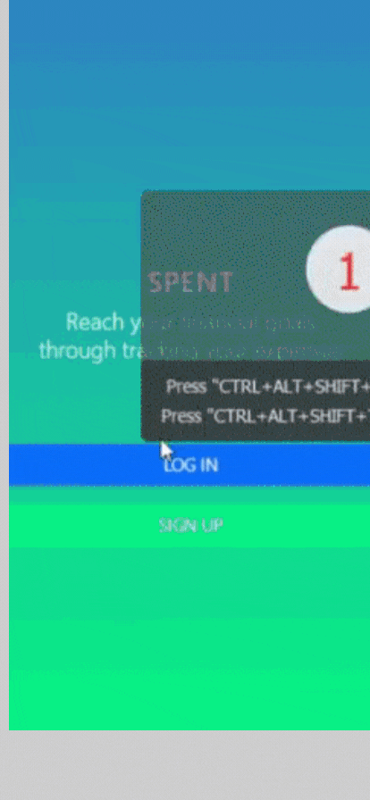
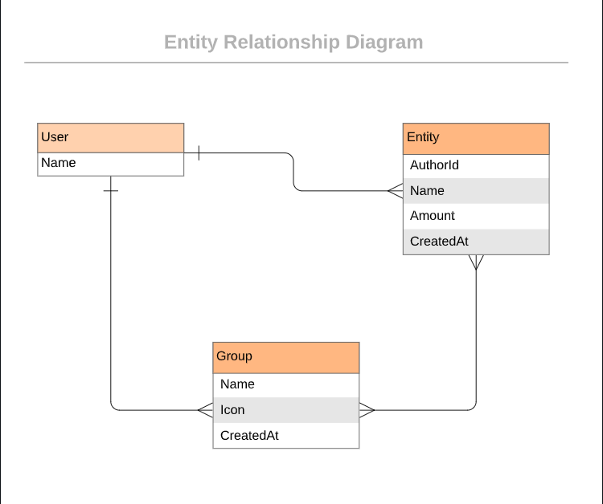

# Spent

> Most of the people do not track how they spend their money while it is the best way that can help them achieve their financial goal. Spent is the expense tracking mobile-first web app that helps the user to track how and where they spent their money. Transactions are grouped by the category to help them know where they spend most of their money. It is built with Ruby on Rails and Bootstrap to handle beautiful user interface.

### Quick Preview



### Live Demo
  [Demo](https://cspent.herokuapp.com/)

### How to build the Spent app
The end result should follow the following data model (this is an Entity Relationship Diagram that you are already familiar with):

> 

# Built with
- Ruby
- Ruby on Rails
- Rubocop
- Bootstrap
- Gems
  - Rspec
  - Capybara
  - Shoulder-matcher
  - Selenium-webdriver
  - cancancan
  - Devise
  - FactoryBot
  - Faker
  - Mail-catcher

# Get Started
Follow these steps below:

## Pre-requisites

```bash
- Ruby
- Rails
- PostgreSQL
```

## Setup
Clone the repo and run bundle install in the command line to install the dependencies

```bash
$ git clone https://github.com/BertrandConxy/Spent.git
$ cd Spent
```

## Install gems with:

```bash
$ bundle install
```

## Install style linters with
```bash
$ npm install
```

## Play with the code
```
rails c
```

## Populate the db with dummy data
```
rails db:migrate
rails db:seed
```

## Run linters
```
rubocop -A
```

## Run test on project with

```bash
$ rspec
  - this will run all the test cases
```

```bash
$ rspec spec/folder_name/name_of_test_file.rb
  - to run test cases individually
```

## Start rails server (puma)

```bash
$ rails server
```

Open [http://localhost:3000/](http://localhost:3000/) in your browser


## Author

👤 **Bertrand Mutangana Ishimwe**

- GitHub: [@BertrandConxy](https://github.com/BertrandConxy)
- Twitter: [@Bconxy](https://twitter.com/BertrandMutanga)
- LinkedIn: [Bertrand Mutangana Ishimwe](https://www.linkedin.com/in/bertrandmutangana)

## 🤝 Contributing

Contributions, issues, and feature requests are welcome!

Feel free to check the [issues page](../../issues/).

## Show your support

Give a ⭐️ if you like this project!

## Acknowledgments

- Original design idea by [Snapscan - iOs design and branding](https://www.behance.net/gallery/19759151/Snapscan-iOs-design-and-branding?tracking_source=)
- Many thanks to Microverse
- Thanks to everyone whose ideas were used to achieve this project

## 📝 License

This project is [MIT](./MIT.md) licensed.
